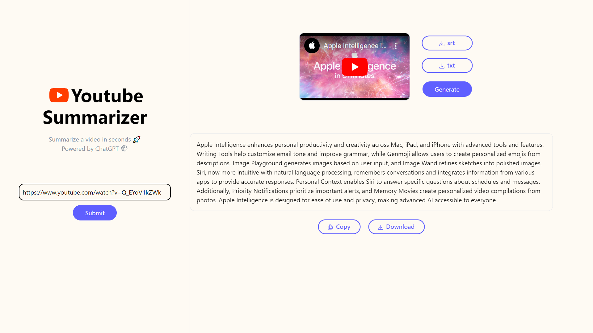

# YT Summarizer

YT Summarizer is a web application that allows users to get summaries of YouTube videos with captions. The project is built using Python, Django, HTMX, Tailwind CSS, and the OpenAI API.

## Table of Contents

- [Features](#features)
- [Demo](#demo)
  - [Interface](#interface)
- [Setup Instructions](#setup-instructions)
- [Technologies Used](#technologies-used)

## Features

- Download the captions of YouTube videos in `.txt` or `.srt` format.
- Get a summary of any YouTube video.

## Demo

### Interface


## Setup Instructions

To set up and run the application locally, follow these steps:

1. **Clone the repository:**
    ```bash
    git clone https://github.com/Sheel-ui/yt-summarizer.git
    ```

2. **Create a virtual environment using Conda:**
    ```bash
    cd yt-summarizer
    ```

3. **Create a virtual environment using Conda:**
    ```bash
    conda create -n <envname> python=3.10
    ```

4. **Activate the virtual environment:**
    ```bash
    conda activate <envname>
    ```

5. **Install the necessary dependencies:**
    ```bash
    pip install -r requirements.txt
    ```

6. **Set up the OpenAI API key:**
    - Create a `.env` file in the project root.
    - Add your OpenAI API key to the `.env` file:
      ```
      OPENAI_API_KEY=your_openai_api_key
      ```

7. **Run the Django development server:**
    ```bash
    python manage.py runserver
    ```

## Technologies Used

- **Backend:** Python, Django
- **Frontend:** HTMX, Tailwind CSS
- **API:** OpenAI API
